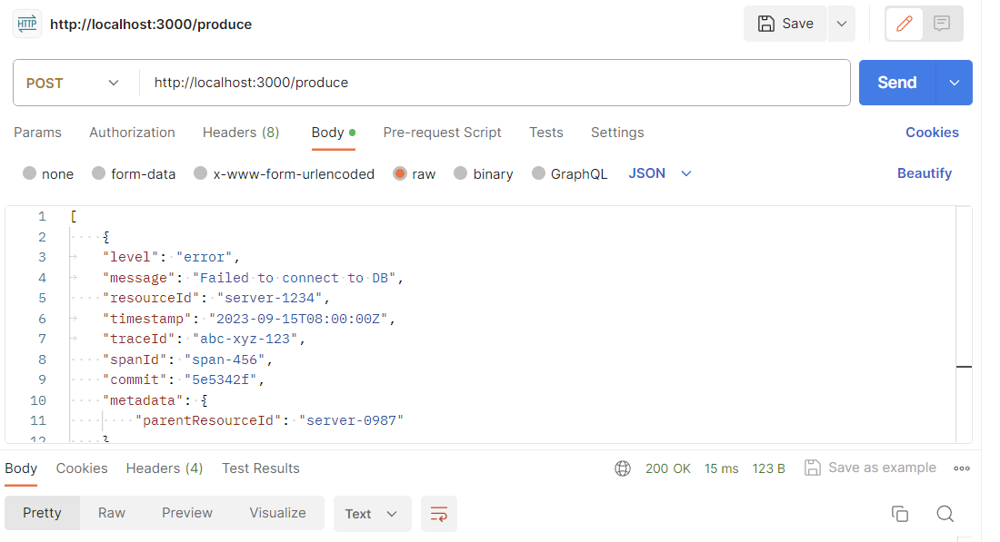
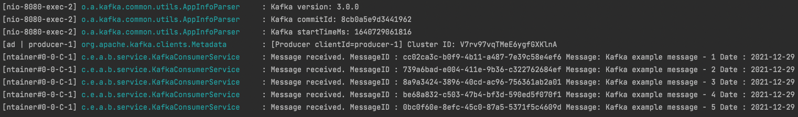
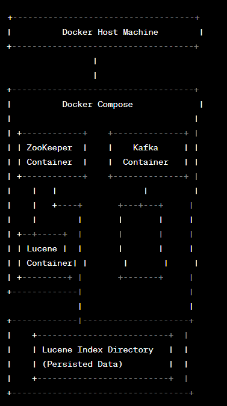

### Spring For Kafka Basic Example

This repository includes basic implementation and usage of Kafka in Spring Boot.

Implementation details :
More details about Spring for Kafka : https://docs.spring.io/spring-kafka/reference/html/

### Install and Run Kafka

Go to `src/main/resources` and run command down below.

```
docker-compose up
```

docker-compose file will pull and start Kafka by using docker-kafka images of bitname/kafka:latest.


### Producing Message Over Rest API




### Consuming Message Over KafkaListener



### License

This project is licensed under the MIT License.




Description:

Docker Host Machine: Represents the physical or virtual machine where Docker is installed.

Docker Compose: Orchestrates the deployment of multiple containers, including ZooKeeper, Kafka, and Lucene.

ZooKeeper Container: Manages distributed coordination and synchronization for Kafka.

Kafka Container: Serves as the message broker for communication between producers and consumers.

Lucene Container: Runs the Lucene indexing process. It consumes messages from Kafka and indexes them into the Lucene index.

Lucene Index Directory: Represents the persistent storage for the Lucene index, where indexed data is stored.

This architecture assumes a basic setup where:

Kafka producers produce messages to Kafka topics.
Kafka consumers (Lucene containers) consume messages from Kafka topics.
Lucene containers index the received messages into the Lucene index directory.

### Author

[Parth Sarthi Prasad](https://www.linkedin.com/in/psarthi2)
